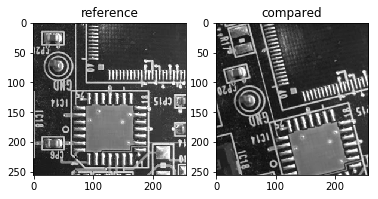
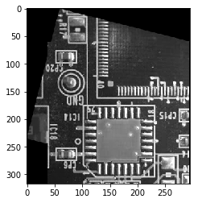
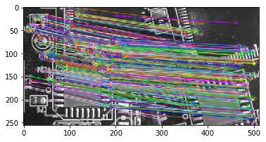

# Robust FFT-Based Image Registration Tools for Python
This program provides robust image registration method using "Phase Correlation" technique.

With this toolbox, you can estimate 
Translation, Rotation and Scaling between two images.

Output form is supported: Affine Matrix, each parameter
If you used this programs, please cite our paper below ``( Now Under Construction Please Wait for a While )``:

>  Y. Ri, H. Hiroshi Fujimoto. : \`\`Practical Phase-Only Correlation Algorithm for Robust and Accurate Image Sencing'', <i> Now Under Review </i> Vol. X, pp.XX. (20XX) 

# Getting started 
## Requirements
- Python3.X (3.5 is recommended)
- opencv-python
- opencv-contrib-python
- numpy
- matplotlib

Recommend opencv version is 3.X.
For windows users, **anaconda** is one of the choise to install both of this.

## Install

```
git clone https://github.com/YoshiRi/ImRegPOC
cd python_package
python setup.py install
```

or using pip

```
git clone https://github.com/YoshiRi/ImRegPOC
cd python_package/dist
pip install "ImRegPOC-1.0-py3-none-any.whl"

```

# Test
There are two classes included in this module.
Both classes supports the image registration method.

## preparation

Import modules and read monocular images. 
```python
import cv2
import numpy as np
import imregpoc

# read monocular image
ref = cv2.imread('ref.png',0)
cmp = cv2.imread('cmp.png',0)

```



## Phase-Correlation
Read monocular images and put two images to the `imregpoc` class.

```python
# initialization
result = imregpoc.imregpoc(ref,cmp)
```

You can get perspective transformation matrix with

```
>>> result.getPerspective()


```

or can get transformation parameters of [x traslation, y translation, rotation, scaling].

```
>>> result.getParam()


```

The merit of this method is that you can detect the success of this estimation via checking certain value.
You can use isSucceed() function to check it. (0/1 to failure/succeed)

```
>>> result.isSucceed()
1
```


Finally you can see stitched image based on the matching results.
```
>>> result.stitching()
```



## Feature points based template track 

If you can use opencv-contrib package, this `TempMacher` class also support feature points based matching.
You can use following descriptors.
- SIFT
- SURF
- KAZE
- AKAZE
- ORB

Here is sample code.

```python
# read monocular image
ref = cv2.imread('ref.png',0)
cmp = cv2.imread('cmp.png',0)

# initialization (SIFT can be changed to other descriptor)
matcher = imregpoc.TempMatcher(ref,'SIFT')

```

match() function can do matching with the chosen descriptor.

```python
matcher.match(cmp,1) # you can ommit like matcher.match(cmp) to avoid show matched image
```


```python
# perspective transformation matrix (Homography matrix)
matcher.getPerspective()
# stitching two images based on the matching result
matcher.stitching()
```


For further function, please see `./python_package/test.ipynb`.


# LICENSE
BSD license

## Author and Citation
Currently please refer [following paper](http://hflab.k.u-tokyo.ac.jp/papers/2017/SAMCON2017_ri.pdf)
:
> Y. Ri and H. Fujimoto, “Image Based Visual Servo Application on Video Tracking with Monocular Camera Based on Phase Correlation Method,” The 3rd IEEJ international workshop on Sensing, Actuation, Motion Control, and Optimization, 2017.

For the further explanation about this package, please wait for a while for my newer paper.
